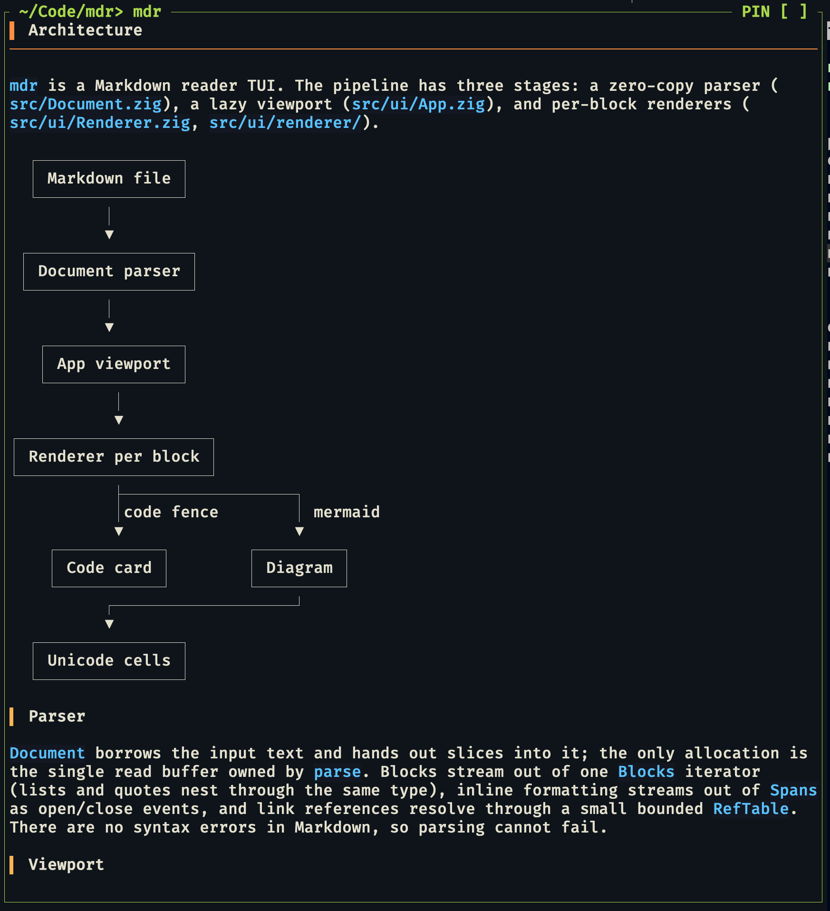

# mdr

A Markdown reader for the terminal, written in Zig. Parses lazily so huge
files open instantly, and renders through [libvaxis](https://github.com/rockorager/libvaxis).



## Build and run

Requires Zig 0.17.0-dev.27+0dd99c37c.

```sh
zig build            # produces zig-out/bin/mdr
zig build test       # unit tests
zig fmt .            # format before committing

mdr <file.md>
```

## Keys

| Keys | Action |
|---|---|
| `j` / `k`, arrows | Scroll one line |
| `Space` / `f`, `Ctrl-f` / `Ctrl-b` | Page down / up |
| `Ctrl-d` / `Ctrl-u` | Half page down / up |
| `g` / `G`, Home / End | Top / bottom |
| `/` then type | Search, jumps to the first match after a short delay |
| `Enter` / `Esc` in search | Keep highlight and close / clear search |
| `n` / `N` | Next / previous match (`1/3` counter top right) |
| `Ctrl-Backspace` / `Alt-Backspace` in search | Clear the query |
| `Ctrl-l` | Redraw |
| `q`, `Ctrl-c` | Quit |

## Features

- CommonMark plus GFM strikethrough, task lists, tables, and reference links
- Fenced code blocks as cards with syntax highlighting for Bash, C, C++, Go,
  JSON, JavaScript/JSX, Python, Rust, TypeScript/TSX, and Zig; local images via Kitty graphics
- A Mermaid subset rendered as unicode diagrams: `graph`/`flowchart` nodes
  and edges plus `sequenceDiagram` participants, messages, notes,
  `loop`/`alt`/`opt`/`par` fragments, activations, and autonumber
- Unsupported Mermaid syntax and unrenderable layouts fall back to the code card;
  see [`docs/MERMAID.md`](docs/MERMAID.md) for the support matrix

## Testing

`zig build test` runs unit tests and fuzz corpora. `zig build bombadil`
drives the TUI through a pseudo-terminal with randomized input (see
`bombadil/`).
