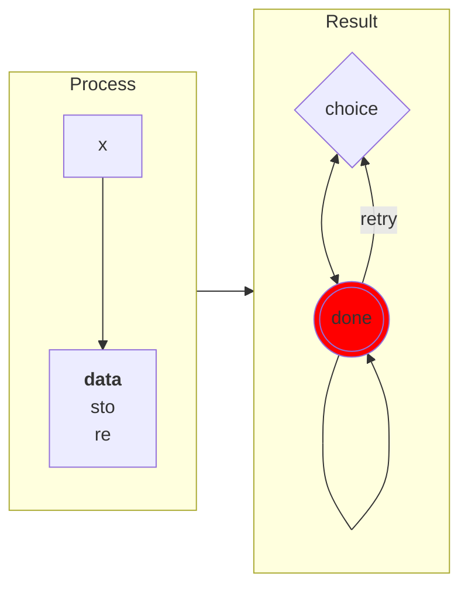
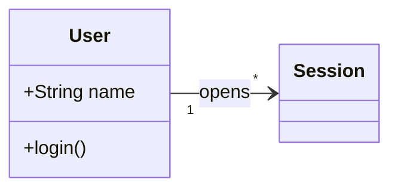
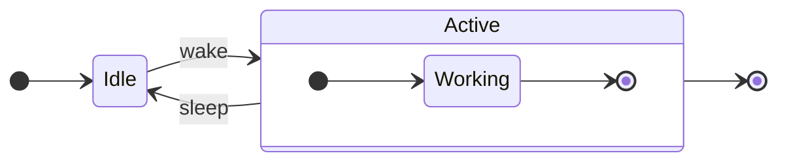
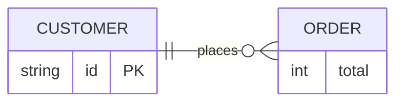

# BOMBADIL_START

This fixture exercises the markdown reader through a real pseudo-terminal.

It contains **strong text**, *emphasis*, ~~deleted text~~, and a [link](https://example.com).

> A block quote introduces nested content.
>
> - quoted item one
> - quoted item two

## Lists

- first unordered item
- second unordered item
  - nested unordered item
- third unordered item

1. first ordered item
2. second ordered item
3. third ordered item

- [ ] unfinished task
- [x] finished task

## Table

| Feature | State | Notes |
|:--------|:-----:|------:|
| headings | ready | bold |
| lists | ready | nested |
| tables | ready | aligned |

## Code

```zig
pub fn main() void {
    const answer = 42; // highlighted token kinds
    std.debug.print("hello from mdr\\n", .{answer});
}
```

    indented code remains visible
    across multiple source lines

## Diagram



```mermaid
%%{init: {'theme': 'base'}}%%
sequenceDiagram
title: Service exchange
    box Purple Services
        participant Alice@{ "type": "boundary" }
        participant Bob@{ "type": "database" }
    end
    link Alice: Dashboard @ https://example.com/dashboard
    properties Alice: role admin
    details Bob: primary database
    autonumber 2.5 0.25
    critical Greeting
        Alice->>Bob: Hello<br/>Bob #9829;
    option Retry
        Alice->>Bob: Hello again
    end
    activate Bob
    activate Bob
    Note over Bob: Thinking
    Bob-->>Alice: Hi
    deactivate Bob
    deactivate Bob
    Bob/|-Alice: Reverse half
    Alice()->>()Bob: Central
    par_over Onboarding
        create actor Carol
        Alice->>Carol: Welcome
    and Cleanup
        destroy Carol
        Carol--xAlice: Bye
    end
```







---

## Unicode

Greek: α β γ δ ε ζηθ.

Cyrillic: Ж Д Й Ф Я.

Wide characters: 日本語 한국어 中文.

Emoji: 😀 🐉 🚀.

## Scrolling section one

Line 01 keeps the document taller than the viewport.

Line 02 keeps the document taller than the viewport.

Line 03 keeps the document taller than the viewport.

Line 04 keeps the document taller than the viewport.

Line 05 keeps the document taller than the viewport.

Line 06 keeps the document taller than the viewport.

Line 07 keeps the document taller than the viewport.

Line 08 keeps the document taller than the viewport.

Line 09 keeps the document taller than the viewport.

Line 10 keeps the document taller than the viewport.

## Scrolling section two

Line 11 keeps the document taller than the viewport.

Line 12 keeps the document taller than the viewport.

Line 13 keeps the document taller than the viewport.

Line 14 keeps the document taller than the viewport.

Line 15 keeps the document taller than the viewport.

Line 16 keeps the document taller than the viewport.

Line 17 keeps the document taller than the viewport.

Line 18 keeps the document taller than the viewport.

Line 19 keeps the document taller than the viewport.

Line 20 keeps the document taller than the viewport.

## HTML boilerplate

<div align="center">


<br data-bombadil="spacer">

Visible caption under skipped boilerplate.

</div>

## Final section

The final marker must be reachable after End or `G` from every explored state.

BOMBADIL_END
