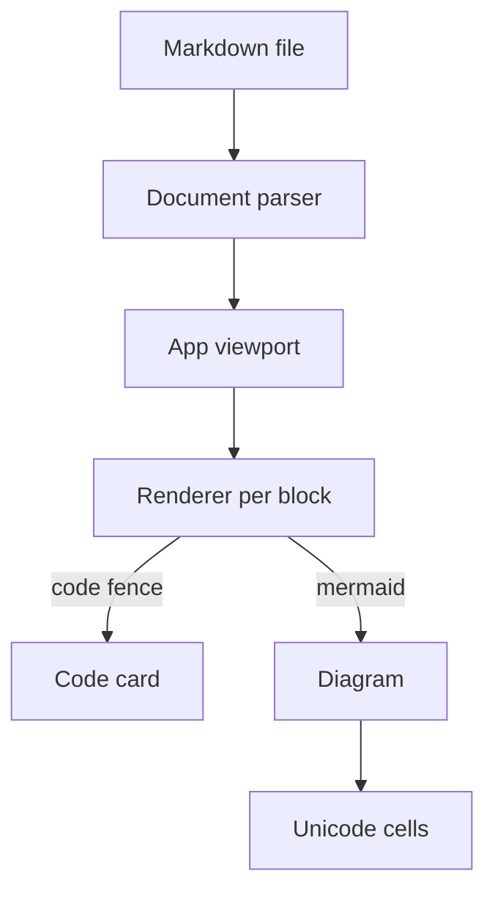
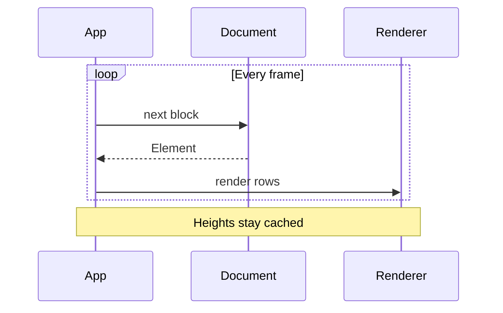

# Architecture

`mdr` is a Markdown reader TUI. The pipeline has three stages: a
zero-copy parser (`src/Document.zig`), a lazy viewport (`src/ui/App.zig`),
and per-block renderers (`src/ui/Renderer.zig`, `src/ui/renderer/`).

## Parser

`Document` borrows the input text and hands out slices into it; the only
allocation is the single read buffer owned by `parse`. Blocks stream out
of one `Blocks` iterator (lists and quotes nest through the same type),
inline formatting streams out of `Spans` as open/close events, and link
references resolve through a small bounded `RefTable`. There are no
syntax errors in Markdown, so parsing cannot fail.

## Viewport

`App` parses and measures elements only until the visible bottom is
covered, caching heights beside their elements, so huge files draw
immediately and scrolling parses on demand. A frame never blocks: media
decodes on background tasks while the main loop keeps polling input.
Images go through Kitty graphics with unicode placeholders as fallback.

## Rendering

Measuring and rendering are the same walk: a null window counts rows
without writing, so the two can never disagree. Each block kind owns a
`renderer/` submodule dispatched from `Renderer.zig`.

Mermaid fences dispatch twice: `Mermaid.parseBlock` (flowcharts) then
`Mermaid.parseSequenceBlock` (sequences). Both parsers are zero-copy
with bounded tables. They reject the whole diagram when a statement is
unsupported instead of rendering a partial result. Anything unsupported,
over capacity, cyclic, or wider than the viewport degrades back to the code
card instead of failing. Flowcharts without subgraphs use ranked layout;
subgraphs use a bounded recursive hierarchy layout with obstacle detours.
Sequence
participant groups, lifecycle positions, activation stacks, numbering state,
and message metadata are fixed parser state from which header and lifeline rows
are derived. Diagram text streams into measured lines without allocating, so
multiline boxes preserve the measure/render invariant. Message endpoints and
central connections are explicit enums,
keeping rendering exhaustive. The supported grammar is
listed in [`MERMAID.md`](MERMAID.md). Shared cell drawing (junction merging, clipping,
display widths) lives in `renderer/cells.zig`.
